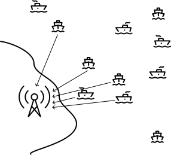
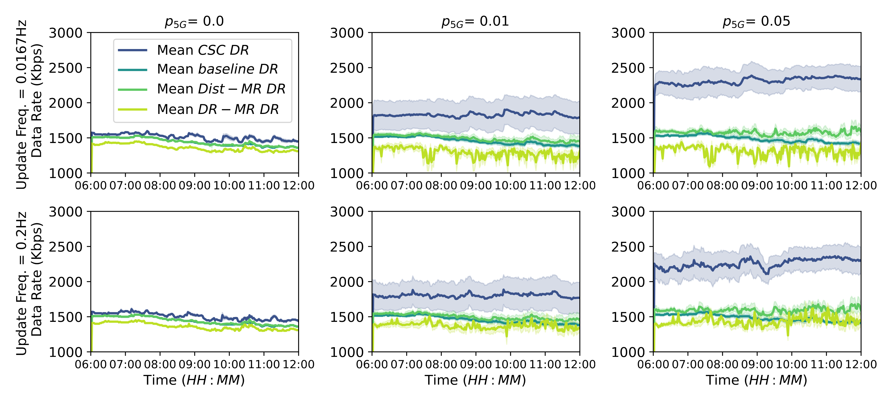
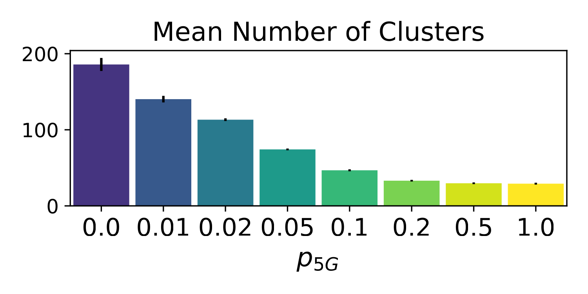
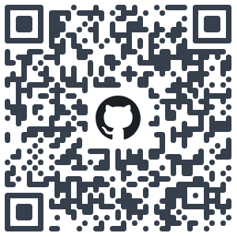

+++
title = "Cognitive Agents in the Field"
outputs = ["Reveal"]
+++

## Robust Communication 
## through Collective Adaptive Relay Schemes
## for Maritime Vessels

<br />

*Martina Baiardi*<sup>1</sup>, Ghassan Al-Falouji<sup>2</sup>, Danilo Pianini<sup>1</sup> and Sven Tomforde<sup>2</sup>
<br />
<br /><small>
<sup>1</sup> University of Bologna, Italy <br/>
<sup>2</sup> University of Kiel, Germany <br/>
</small>

---

{}
{}

## Context: Autonomous Maritime Operations

* **MASS** (Maritime Autonomous Surface Ships): (semi)autonomous vessels which heavily rely on sensors for operating in the environment. 

* Support the transition towards MASS by achieving *situational awareness*.

{}
{}

<!--  -->

<br />
<small>Generated by OpenAI Sora</small>

{}
{}

---

{}
{}

## Autonomy & throughput needs

Situational awareness for autonomous vessels requires:

1. The availability of *high-throughput* sensors, and 
2. A *communication infrastructure* to support the transmission of sensors data.  

Moreover, ship-to-shore communication is a regulatory requirement for maritime operations, essential for *safety* supervision, operational *control*, and *remote* *management*—especially important for autonomous vessels.

{}
{}

<small>Generated by OpenAI Sora</small>

{}
{}

---

## Challenges

{}
{}

* Dynamic sparse vessels distribution
* Environmental conditions
* The variety of communication means onboard

{}
{}

* Traditional maritime communication system limited bandwidth 
* Satellite communication, requires either expensive antennas not equipped on the vessel or suffers with high latency.
* Cellular coverage (e.g. 4G and 5G) is limited to coastal areas, and cannot reach open sea directly.

{}
{}


---

{}
{}

## Approach

In this work, we address the communication challenge: we propose novel decentralized network techniques to improve sensors’ data transport and collection in the maritime environment.

To do so, we propose four network approaches:
1. Non-collaborative direct communication towards shore station
2. MST Distance-based multi-relay communication
3. MST Data rate-based multi-relay communication
4. Collective Summarization Clusters

{}
{}


<br/>


{}
{}

---

{}
{}

## 1. Non-Collaborative Direct Communication

Inspired to current network topology, vessels communicate directly towards shore station whenever they have some bandwidth available.

The limitations of this approach are intuitive:

1. Limited coverage of vessels
2. Shore station as a bottle-neck 
3. Information redundancy 


{}
{}

<div style="text-align:right;">


</div>
<div style="text-align:right;">


</div>

{}
{}

---

{}
{}

## 2. Distance-based Multi-Relay Communication

* All vessels that cannot communicate with shore station with sufficient bandwidth *relay* its data stream to a vessel along the geographical shortest path towards the land station.

* Direct communication with the relay may be insufficient, while using vessels not on the shortest path may be more effective.

{}
{}

<div style="text-align:left;">


</div>
<div style="text-align:left;">


</div>

{}
{}

---


{}
{}

## 3. Data Rate-based Multi-Relay Communication

This network improves the Distance-based Multi-Relay Communication by selecting the relay which *maximises* the *data rate* instead of minimising the distance.

{}
{}

<div style="text-align:right;">


</div>
<div style="text-align:right;">


</div>

{}
{}

---

{}
{}

## Collective Summarisation Clusters (CSC)

* IDEA: high-fidelity data can be collected locally, then summarised at strategic points within the network and finally forwarded toward the land station.

* Vessels self-organise into *clusters* where data can be collected in a designated *summariser*. The leader then forwards the summarised output to the land station or to a relay in the next cluster.

{}
{}

<div style="text-align:left;">


</div>
<div style="text-align:left;">


</div>

{}
{}

---



## Aggregate Programming

{}
{}

* AP is a *functional macroprogramming* paradigm centered around the notion of a *computational field*: a distributed data structure that maps points in space and time to values.

* In particular, the priority-based leader election, network partitioning, and data summarisation is an instance of the **Self-Organising Coordination Region Aggregate Pattern**.

We adopted Collektive¹ as framework for Aggregate Programming. 


<small>

¹ https://collektive.github.io/

</small>

{}
{}

```java
val drAround = neighboring(drDistance)
val potRelays: Field<Boolean> = neighboring(leader)
  .alignedMap(drAround) { l, d ->
    // Other cluster and closer to the station
    l != leader && d < drDistance
}
val dists = metric + drAround
val myRelay = potRelays.alignedMap(dists) { r, d ->
  if (r) d else Double.POSITIVE_INFINITY
}
val imRelay = neighboring(myRelay).any { it == localId }
val upstreamDR = 1 / metric[myRelay]
```

{}
{}

---

{}
{}

## Simulation Setup

* All vessels are equipped with: GPS, ARPS (VHF), Wi-Fi, and 5G consumer module

* $p_{5G}$ percentage of vessels with 5G repeater

* Real navigation data (from Kiel Fjord)
   * 6 hours time window from August 18, 2022

* Open data used to locate 5G towers and the AIS shore stations along the Kiel coast.

* We used Alchemist² to perform the simulation, which is an open-soure event-driven simulator supported by the Aggregate Programming framework.

<small>

² https://alchemistsimulator.github.io/

</small>


{}
{}


{}
{}

---

## Evaluation

As evaluation metric we measure the data rate that each vessel transmit for each network configuration.



---

## CSC Evaluation




---

## Limitations & Future Work

- The navigation data used in the simulation is limited to a six-hour time window of a single day, which may not be representative of the entire maritime traffic in the area (or worldwide). Further experimentation will be performed in future work. 
- In this work we did *not* focus on finding *summarisation algorithms*. Promising research directions include fusion methods deserving a future dedicated investigation (*Ghassan Al-Falouji@SISSY* presented this roadmap).
- Adverse and mutating *weather conditions* have not been taken into account in this work, it is interesting to evaluate the impact of these conditions to the communication quality and the resulting algorithms behaviour.

---

## Conclusion
Source code for executing and reproducing experiments is freely available on GitHub under permissive license.



### Thank you
