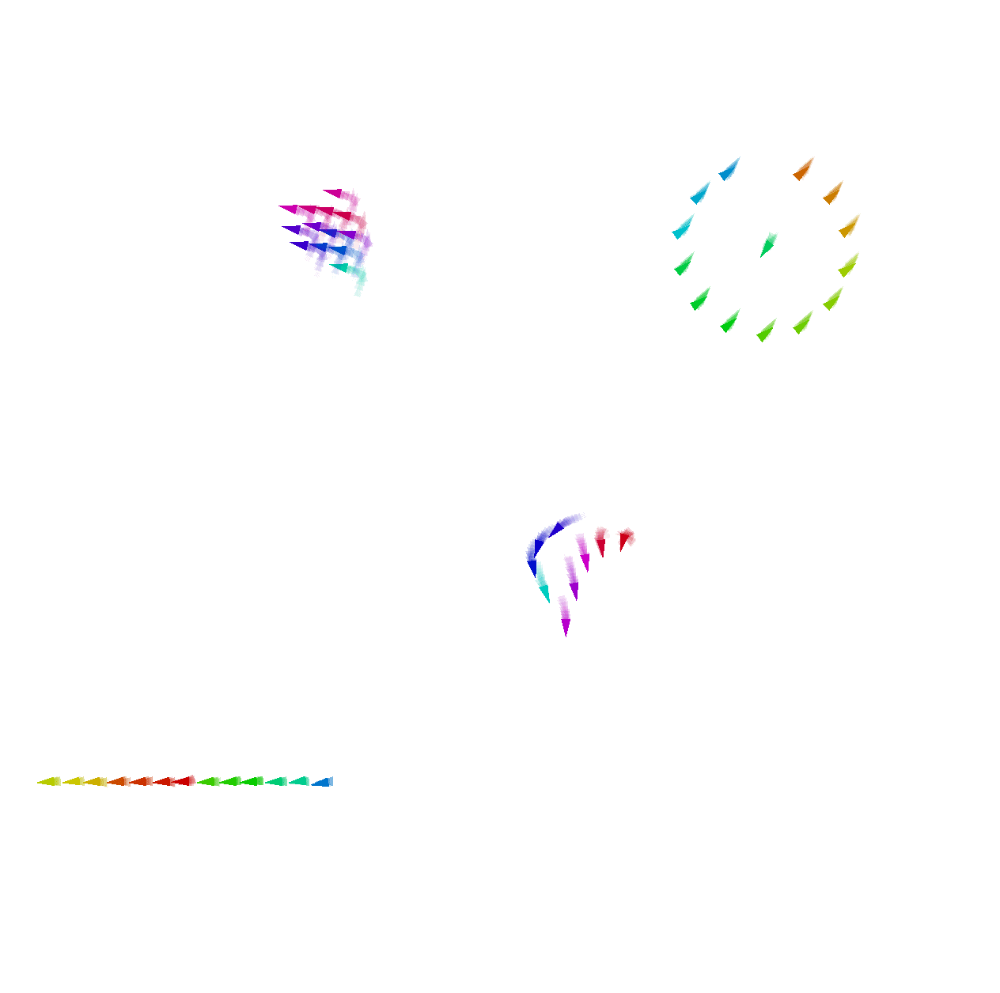

+++
title = "Cognitive Agents in the Field"
outputs = ["Reveal"]
+++

## Robust Communication 
## through Collective Adaptive Relay Schemes
## for Maritime Vessels

 

*Martina Baiardi*1, Ghassan Al-Falouji2, Danilo Pianini1 and Sven Tomforde2
 
 <small>
1 University of Bologna, Italy  
2 University of Kiel, Germany  
</small>

---

{}
{}

## Context: Autonomous Maritime Operations

* Maritime transport: 80% of world trade, growing automation.

* MASS (Maritime Autonomous Surface Ships): efficiency, safety, cost.

**Maybe add picture of trade report ?**

{}
{}

<!--  -->

 
<small>Generated by OpenAI Sora</small>

{}
{}

---

{}
{}

## Rise of Autonomy & Data Collection

 * MASS require real-time situational awareness for collision avoidance.
 * Vessels are equipped with sensor suites (cameras, LiDAR, radar).
 * => High data volumes, low latency needs.

{}
{}

 
<small>Generated by OpenAI Sora</small>

{}
{}

---

## The Communication Challenge

 * Sparse vessels, harsh environment, legacy tech, high data needs.
 * Traditional maritime comms: VHF, SatCom, Wi-Fi, cellular—limitations in bandwidth, range, latency.

---

## Need for Robust, Adaptive Communication

{}
{}

 * Real-time ops, emergency, regulatory needs.

{}
{}

 * Visual: IDK maybe a ship in distress needing urgent assistance?

 {}
{}

---

## Proposed Solution: Adaptive, decentralized relay schemes.

{}
{}

MST-based and cluster-based relays, aggregate programming, simulation validation.

{}
{}

 

{}
{}

---

## Aggregate Programming: Quick introduction

{}
{}

Macro-programming, computational fields, self-organization.

{}
{}

{}
{}

---

## Baseline Relay Mechanism

{}
{}

{}
{}

{}
{}

---

## Distance-based Multi-Relay

{}
{}

Each vessel relays to the geographically closest station.

{}
{}

{}
{}

---

## Data Rate-based Multi-Relay

{}
{}

Relays chosen to maximize data rate, not just distance.

{}
{}

{}
{}

---

## Collective Summarisation Clusters (CSC)

{}
{}

Vessels form clusters, leader summarizes and relays data.

{}
{}

{}
{}

---

## Simulation Setup
{}
{}

* Real-world data (Kiel Fjord), simulation environment, vessel equipment.

{}
{}

{}
{}

---

## Evaluation Metrics
Data rate, reduction factor, cluster size, singleton clusters.
Visual: List with icons, metric definitions.

---

## Results: Quick discussion
* CSC outperforms others, even with few 5G-equipped vessels.
* Cluster size, reduction factor, number of clusters.

---

## Limitations & Future Work
Data, corner cases, security, summarization, weather, ML adaptation.
Visual: Roadmap, question marks, icons for each limitation.

---

## Conclusion
Recap: Cluster-based relays, 5G impact, scalability, real-world value.
Visual: Summary graphic, key takeaway.
